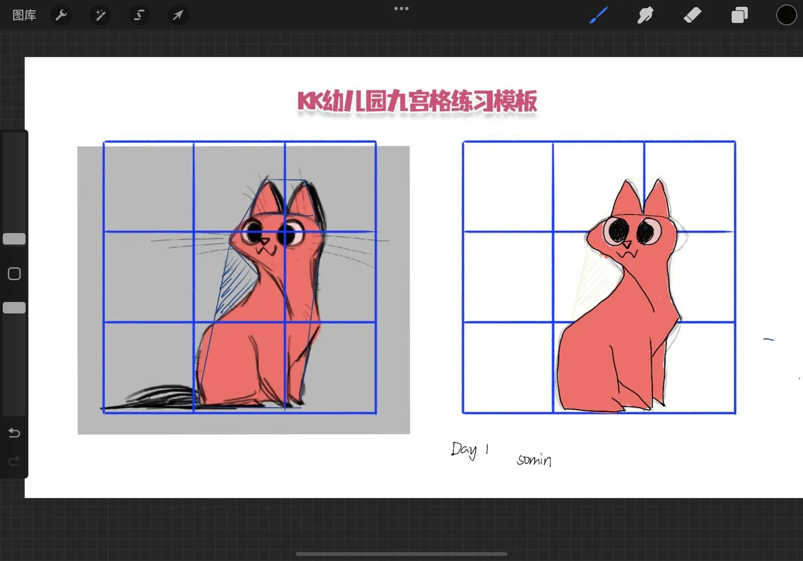

- [[GS4]]
  collapsed:: true
  :LOGBOOK:
  CLOCK: [2022-05-29 Sun 17:14:50]--[2022-05-29 Sun 18:08:08] =>  00:53:18
  :END:
	- 放学后看到御影的选择项
		- 一緒に帰ろうと誘う
			- （邀请他一起回去）
			- 生词
				- 一緒に：いっしょに
				- 誘う：さそう
			- 喫茶店に寄ろうと誘う
				- （约他去咖啡店）
				- 生词
					- 寄る ➜ 寄ろ：よる
			-
- [[绘画抓型打卡]]
  collapsed:: true
	- day1
	  collapsed:: true
		- 
		- 总之福至心灵地学会了图层，勾线，还算有点收获（……）
-