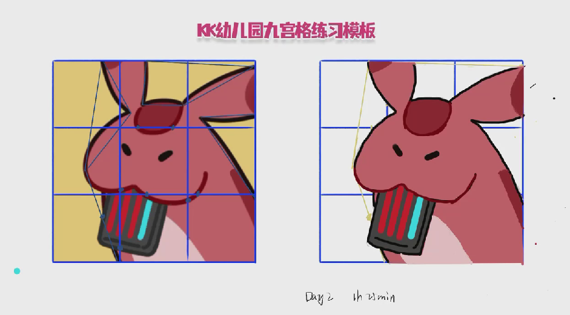

- [[绘画抓型打卡]]
	- Day2
	  collapsed:: true
		- 
		- 感想：不是很会打框（只能抓住几个三角形的点，剩下的就都是用点来标识位置了）
			- 线条也不太好，最后是通过反复画来调整弧形的，调完了也就那样，同时也反复叠图来确认位置是不是靠谱。
			- 肚子那块居然是一笔画成的，叠图也显示比较准，惊呆了。
			- 
			- 烬楠说嘴这里可以用两个小三角形来概括，这样可以让弧度更短，画出来更精确。
- [[中庭角落的情书信箱]]
	- [[应用]] 如何通过 Bypass (旁路) Paywalls阅读经济学人？
		- https://forum.freemdict.com/t/topic/1436
		- 绕过主流杂志的付费墙
- [[我们为什么要睡觉]]
	- 在看睡眠相关的书，原来褪黑素只相当于发令枪，负责告诉人体“该睡了”而不能辅助睡眠，所以大部分褪黑素药品的安慰剂作用远大于真实的药物作用。
	- 咖啡因也和我想象的不同，它只起到了遮蔽作用，通过类似“捂住耳朵”的方式来抑制受体，使之感知不到腺苷传递的困意信号，当咖啡因被代谢掉，巨大的困意就会席卷而来，因为腺苷已经等得不耐烦了。
	- 为什么人在通宵的状态下仍然能保持精力（甚至在白天能回复一些精力？）：因为影响睡眠的两个因素（昼夜节律和腺苷）是彼此分离的，通宵压抑了腺苷释放的睡眠压力，但是昼夜节律仍然忠实地在执行“白天精力较好”这个设定，因此哪怕通宵，第二天的11点可能仍然会觉得精力充沛——但是腺苷未被释放的睡眠压力仍在累积，到了下午昼夜节律的作用就很难再与腺苷对抗。