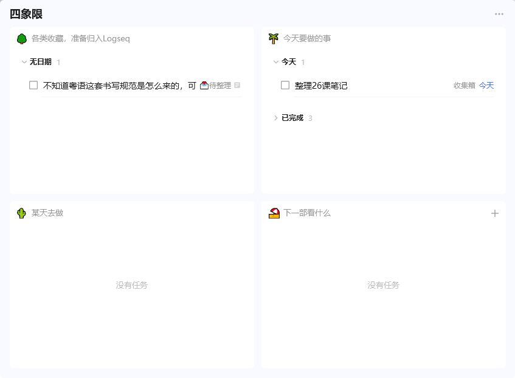

- 在想要不要买滴答清单的会员，决定先梳理一下滴答清单的会员能做什么
	- 买了买了！！改了四象限的名称，一目了然
	  collapsed:: true
		- 
	- 其他的可以慢慢再装修~
- 和猫里卡拼了少数派的会员，他有之前的会员，所以之前的内容我也都能看了，又便宜又快乐
- [[中庭角落的情书信箱]]
  collapsed:: true
	- [[日语]] 学习: 入门及进阶读物推荐
	  collapsed:: true
		- [日本語多読（にほんごたどく）](https://tadoku.org/japanese/)
		  想按照目前的日语水平进行阅读的话可以参考上面这个日语多读的网站。多读的概念类似于英文的分级阅读，加上希望学习者在尽量不使用辞典的前提下享受阅读日语的体验的要素。该系统会根据相应的level推荐阅读材料，包括一般读本，绘本，漫画，小说等等。
		  网站上有比较详尽的reading level chart可以用来确认自己的日语水平对应的等级。看了一下Level 3~4左右就能看很多流行的漫画，比如《灌篮高手》、《银之匙》、《一个人住第五年》等等。Level 4的书目里还有不少文学家的作品，例如《少爷》、《杜子春》、《跑吧！美乐斯》这些在日本脍炙人口的名篇。按照说明，最高的Level 5相当于N2~N1，所以如果是汉语母语者的话，认真学习一段时间的日语之后是比较容易达到Level 3~4所要求的阅读水平的。另外对于日本境外的用户很友好的一点是很多内容可以免费下载，不用太过担心找不到资源的问题。
	- [[应用]]取消跳转插件：
		- 油猴：[Open the F**king URL Right Now](https://greasyfork.org/zh-CN/scripts/412612-open-the-f-king-url-right-now)
		- Chrome插件：[xTrace](https://chrome.google.com/webstore/detail/xtrace/gnoegjcomgnaofcdeckopfoajfbboplb)
	-