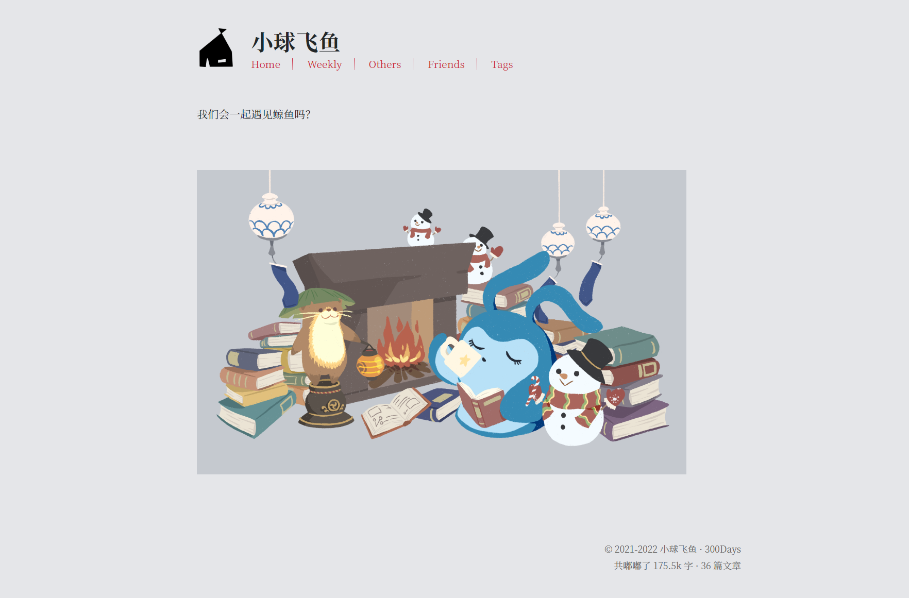

- [[中庭角落的情书信箱]]
  collapsed:: true
	- 关于区分[[blog]]内容的讨论
		- **芋阿圆**：如果用 Hugo 的话，其实操作比较简单的。直接在 content 文件夹里面挨着 posts 新建另一个文件夹比如 murmuring，然后在 murmuring 里设置首页 _index.md，最后在把这个目录添加到 menu 的 config 里面。
		  感觉大部分 Hugo 主题只会把 mainSections 里的部分给导出 rss，所以如果不想自己博客的 rss 订阅里有生活日志的话，就可以在 config 设置里不把 murmuring 添加到 mainSections就好。
		- **酸橘汁腌鱼**：如果是用Hugo的话，我感觉可以通过语言切换的方式实现。把语言切换的功能换成内容切换就行，按照那个结构来做。
		- **芋阿圆**：突然想到其实只要在个人日志这个部分里不要用 tags 就好了，比如换成用log-tags 之类的，因为不管是 tags 还是 categories 它们本质都是 taxonomy。只要用不同的 taxonomy 来打标签就不会混在一起了。可能这个方法最佳简便？
		- **实际操作**：
			- 1. 在`content`中新建`Weekly`，之后一样新建2021和2022两个文件夹，把想分到Weekly分类的文章拖进去，之后在`config.toml`修改以下内容
			  ```
			  [[menu.main]]
			  name = "Weekly"
			  url = "/weekly"
			  weight = 2
			  
			  [[menu.main]]
			  name = "Others"
			  url = "/posts"
			  weight = 3
			  ```
			- 2. 在`layout`里也新建一个`Weekly`文件夹，把`single.html`拖进去，这是为了保证Weekly里的文件点进去之后能看到目录和字数等相关信息
			- 3.修改`index.html`，删掉首页的文章目录和年份标题，插入一张图片
			  ```
			  <div>
			    <a href="/about">
			    
			  </div>
			  
			  <style>
			  #about {
			    margin: 0 0 3.8rem 0;
			    }
			  
			  #feiyu {
			      max-width: 90%;
			      background: #5c697b3b
			  
			  }
			  
			  </style>
			  ```
			- 4. [[Blog装修]]完成！ 
- **21:03**  开始写玩具箱文章，理论上我应该学习的，但是真的好不想学啊
- 结果真的就没学，写了[来得好快的翻箱倒柜第二期](https://mantyke.icu/weekly/2022/toybox-vol.2/)，写到了11点多
- 然后我就去玩儿了！！！